# Dossier de conception UML — Plateforme ITEAG

**Projet** : ITEAG-2026-REFONTE
**Référence CDC** : `src/cahier_de_charge_v2.md` (v2.0)
**Objet du document** : modélisation complète de la plateforme cible, incluant le nouveau
domaine *formation vidéo à distance et contrôle d'accès aux modules*.
**Statut** : document de conception — fait foi pour l'implémentation.

---

## 0. Conventions et légende

### 0.1 Vues architecturales

Le dossier suit le modèle **4+1 vues** :

| Vue | Question à laquelle elle répond | Sections |
|-----|--------------------------------|----------|
| Cas d'utilisation (+1) | Qui fait quoi ? | §1 |
| Logique | Comment le domaine est-il structuré ? | §2, §3 |
| Processus | Comment le système se comporte-t-il dans le temps ? | §4, §5 |
| Développement | Comment le code est-il organisé ? | §2 |
| Physique | Où cela s'exécute-t-il ? | §6 |

### 0.2 Convention de couleur et de statut

Chaque élément de modèle porte l'un des trois statuts suivants :

| Statut | Signification | Rendu |
|--------|--------------|-------|
| **EXISTANT** | Implémenté et couvert par des tests dans `src/apps/` | fond clair |
| **À ÉTENDRE** | Le modèle existe mais doit être enrichi | fond ambré |
| **NOUVEAU** | À créer intégralement | fond vert |

### 0.3 Nommage

Les identifiants de classes et d'attributs des diagrammes correspondent **exactement**
aux noms Python des modèles Django (`PascalCase` pour les classes, `snake_case` pour les
champs). Un diagramme est donc directement traduisible en code sans réinterprétation.

---

## 1. Vue des cas d'utilisation

### 1.1 Acteurs

| Acteur | Description | Volume estimé |
|--------|------------|---------------|
| **Visiteur** | Public non authentifié, prospect | ~5 000 / mois |
| **Candidat** | A déposé un dossier, suit son avancement par lien signé | ~150 / an |
| **Étudiant** | Inscrit à un parcours, accède aux sessions et aux modules vidéo | ~200 actifs |
| **Enseignant** | Professeur ITEAG, produit le contenu et évalue | ~10 |
| **Secrétariat** | Gestion des admissions, inscriptions, paiements, accès | 2–3 |
| **Administrateur** | Configuration, référentiels, éditorial, sécurité | 1–2 |
| **Système** | Tâches planifiées Celery (emails, transcodage, expirations) | — |

### 1.2 Diagramme de cas d'utilisation — vue d'ensemble

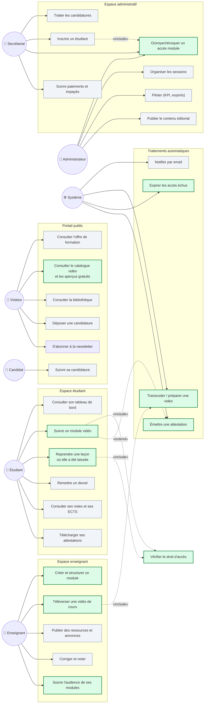
```mermaid
graph LR
    Visiteur(("👤 Visiteur"))
    Candidat(("👤 Candidat"))
    Etudiant(("👤 Étudiant"))
    Enseignant(("👤 Enseignant"))
    Secretariat(("👤 Secrétariat"))
    Admin(("👤 Administrateur"))
    Systeme(("⚙️ Système"))

    subgraph PUB["Portail public"]
        UC1["Consulter l'offre de formation"]
        UC2["Consulter le catalogue vidéo<br/>et les aperçus gratuits"]
        UC3["Consulter la bibliothèque"]
        UC4["Déposer une candidature"]
        UC5["Suivre sa candidature"]
        UC6["S'abonner à la newsletter"]
    end

    subgraph ETU["Espace étudiant"]
        UC10["Consulter son tableau de bord"]
        UC11["Suivre un module vidéo"]
        UC12["Reprendre une leçon<br/>où elle a été laissée"]
        UC13["Remettre un devoir"]
        UC14["Consulter ses notes et ses ECTS"]
        UC15["Télécharger ses attestations"]
    end

    subgraph ENS["Espace enseignant"]
        UC20["Créer et structurer un module"]
        UC21["Téléverser une vidéo de cours"]
        UC22["Publier des ressources et annonces"]
        UC23["Corriger et noter"]
        UC24["Suivre l'audience de ses modules"]
    end

    subgraph ADM["Espace administratif"]
        UC30["Traiter les candidatures"]
        UC31["Inscrire un étudiant"]
        UC32["Octroyer/révoquer un accès module"]
        UC33["Organiser les sessions"]
        UC34["Suivre paiements et impayés"]
        UC35["Piloter (KPI, exports)"]
        UC36["Publier le contenu éditorial"]
    end

    subgraph SYS["Traitements automatiques"]
        UC40["Notifier par email"]
        UC41["Transcoder / préparer une vidéo"]
        UC42["Expirer les accès échus"]
        UC43["Émettre une attestation"]
    end

    Visiteur --> UC1 & UC2 & UC3 & UC4 & UC6
    Candidat --> UC5
    Etudiant --> UC10 & UC11 & UC12 & UC13 & UC14 & UC15
    Enseignant --> UC20 & UC21 & UC22 & UC23 & UC24
    Secretariat --> UC30 & UC31 & UC32 & UC34
    Admin --> UC32 & UC33 & UC35 & UC36
    Systeme --> UC40 & UC41 & UC42 & UC43

    UC11 -.->|"«include»"| UC50["Vérifier le droit d'accès"]
    UC12 -.->|"«include»"| UC50
    UC21 -.->|"«include»"| UC41
    UC31 -.->|"«include»"| UC32
    UC11 -.->|"«extend»"| UC43

    classDef nouveau fill:#DCFCE7,stroke:#15803D,stroke-width:2px
    classDef existant fill:#F1F5F9,stroke:#64748B
    class UC2,UC11,UC12,UC20,UC21,UC24,UC32,UC41,UC42,UC43,UC50 nouveau
    class UC1,UC3,UC4,UC5,UC10,UC13,UC14,UC15,UC22,UC23,UC30,UC31,UC33,UC34,UC35,UC36,UC40 existant
```

> **Lecture** : les cas en vert constituent le périmètre d'extension demandé
> (formation vidéo + accès sécurisé). Le cas pivot est **UC50 « Vérifier le droit d'accès »**,
> inclus par tout accès à un contenu protégé : c'est le point de contrôle unique du système.

---

## 2. Vue logique — packages et dépendances

### 2.1 Découpage en contextes bornés

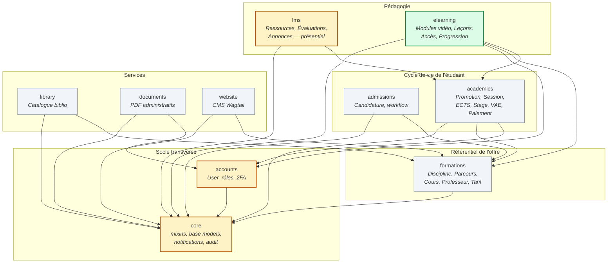
```mermaid
graph TB
    subgraph SOCLE["Socle transverse"]
        core["core<br/><i>mixins, base models,<br/>notifications, audit</i>"]
        accounts["accounts<br/><i>User, rôles, 2FA</i>"]
    end

    subgraph REFERENTIEL["Référentiel de l'offre"]
        formations["formations<br/><i>Discipline, Parcours,<br/>Cours, Professeur, Tarif</i>"]
    end

    subgraph PARCOURS_ETU["Cycle de vie de l'étudiant"]
        admissions["admissions<br/><i>Candidature, workflow</i>"]
        academics["academics<br/><i>Promotion, Session,<br/>ECTS, Stage, VAE, Paiement</i>"]
    end

    subgraph PEDAGOGIE["Pédagogie"]
        lms["lms<br/><i>Ressources, Évaluations,<br/>Annonces — présentiel</i>"]
        elearning["elearning<br/><i>Modules vidéo, Leçons,<br/>Accès, Progression</i>"]
    end

    subgraph SERVICES["Services"]
        library["library<br/><i>Catalogue biblio</i>"]
        documents["documents<br/><i>PDF administratifs</i>"]
        website["website<br/><i>CMS Wagtail</i>"]
    end

    accounts --> core
    formations --> core
    admissions --> core & formations
    academics --> core & formations & accounts
    lms --> core & academics
    elearning --> core & accounts & formations & academics
    library --> core & formations
    documents --> core & accounts
    website --> core & formations

    classDef nouveau fill:#DCFCE7,stroke:#15803D,stroke-width:2px
    classDef etendre fill:#FEF3C7,stroke:#B45309,stroke-width:2px
    classDef existant fill:#F1F5F9,stroke:#64748B
    class elearning nouveau
    class core,accounts,lms etendre
    class formations,admissions,academics,library,documents,website existant
```

### 2.2 Règles de dépendance (invariants d'architecture)

1. **Le graphe de dépendances est acyclique.** Aucune app ne peut importer une app qui
   l'importe déjà, directement ou transitivement.
2. **`core` ne dépend de rien.** Il ne contient que de l'abstrait et du transverse.
3. **`formations` est un référentiel pur** : il ne connaît ni les étudiants ni les sessions.
4. **`elearning` dépend de `academics`** (pour `ProfilEtudiant`) mais **`academics` n'importe
   jamais `elearning`** — le couplage inverse se fait par signaux ou par service applicatif.
5. **Toute règle métier partagée par plusieurs vues vit dans un service**
   (`apps/<app>/services/`), jamais dupliquée dans les vues.

> Ces invariants seront **vérifiés automatiquement** par un test d'architecture
> (`apps/core/test_architecture.py`) qui inspecte le graphe d'imports.

---

## 3. Vue logique — diagrammes de classes

### 3.1 Identité et accès (`accounts`, `core`)

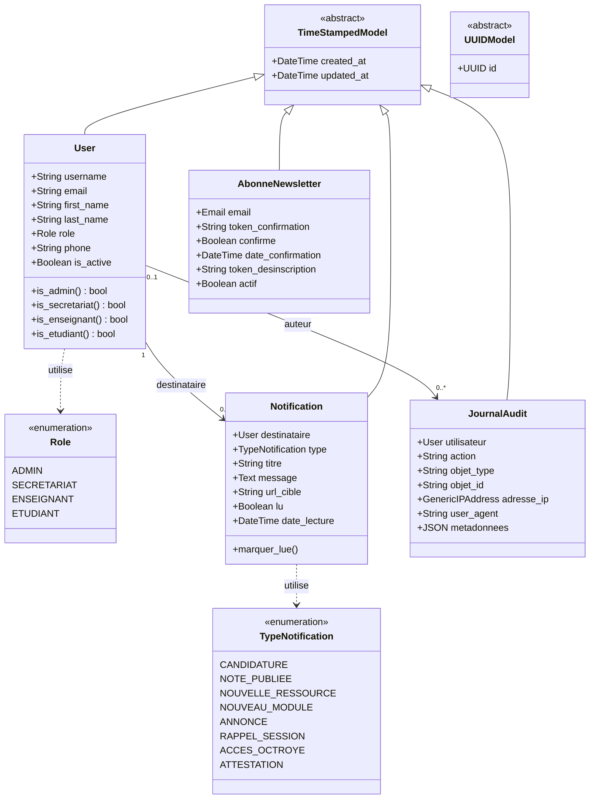
```mermaid
classDiagram
    class TimeStampedModel {
        <<abstract>>
        +DateTime created_at
        +DateTime updated_at
    }

    class UUIDModel {
        <<abstract>>
        +UUID id
    }

    class User {
        +String username
        +String email
        +String first_name
        +String last_name
        +Role role
        +String phone
        +Boolean is_active
        +is_admin() bool
        +is_secretariat() bool
        +is_enseignant() bool
        +is_etudiant() bool
    }

    class Role {
        <<enumeration>>
        ADMIN
        SECRETARIAT
        ENSEIGNANT
        ETUDIANT
    }

    class Notification {
        +User destinataire
        +TypeNotification type
        +String titre
        +Text message
        +String url_cible
        +Boolean lu
        +DateTime date_lecture
        +marquer_lue()
    }

    class TypeNotification {
        <<enumeration>>
        CANDIDATURE
        NOTE_PUBLIEE
        NOUVELLE_RESSOURCE
        NOUVEAU_MODULE
        ANNONCE
        RAPPEL_SESSION
        ACCES_OCTROYE
        ATTESTATION
    }

    class JournalAudit {
        +User utilisateur
        +String action
        +String objet_type
        +String objet_id
        +GenericIPAddress adresse_ip
        +String user_agent
        +JSON metadonnees
    }

    class AbonneNewsletter {
        +Email email
        +String token_confirmation
        +Boolean confirme
        +DateTime date_confirmation
        +String token_desinscription
        +Boolean actif
    }

    TimeStampedModel <|-- User
    TimeStampedModel <|-- Notification
    TimeStampedModel <|-- JournalAudit
    TimeStampedModel <|-- AbonneNewsletter
    User "1" --> "0..*" Notification : destinataire
    User "0..1" --> "0..*" JournalAudit : auteur
    User ..> Role : utilise
    Notification ..> TypeNotification : utilise
```

| Classe | Statut |
|--------|--------|
| `TimeStampedModel`, `UUIDModel`, `User`, `Role` | EXISTANT |
| `Notification`, `TypeNotification` | **NOUVEAU** — couvre ETU-009, non implémenté à ce jour |
| `JournalAudit` | **NOUVEAU** — exigence de traçabilité (CDC §13) |
| `AbonneNewsletter` | **NOUVEAU** — couvre PUB-012, non implémenté |

### 3.2 Référentiel de l'offre (`formations`)

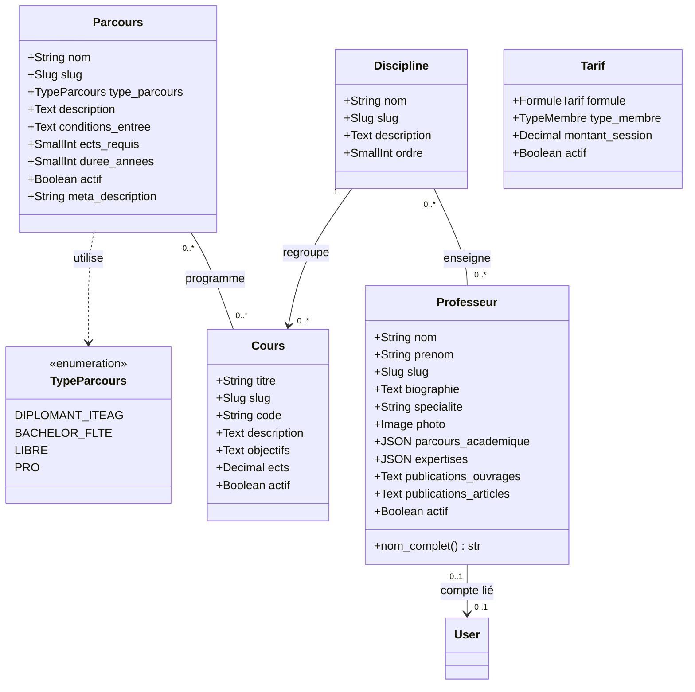
```mermaid
classDiagram
    class Discipline {
        +String nom
        +Slug slug
        +Text description
        +SmallInt ordre
    }

    class Parcours {
        +String nom
        +Slug slug
        +TypeParcours type_parcours
        +Text description
        +Text conditions_entree
        +SmallInt ects_requis
        +SmallInt duree_annees
        +Boolean actif
        +String meta_description
    }

    class TypeParcours {
        <<enumeration>>
        DIPLOMANT_ITEAG
        BACHELOR_FLTE
        LIBRE
        PRO
    }

    class Cours {
        +String titre
        +Slug slug
        +String code
        +Text description
        +Text objectifs
        +Decimal ects
        +Boolean actif
    }

    class Professeur {
        +String nom
        +String prenom
        +Slug slug
        +Text biographie
        +String specialite
        +Image photo
        +JSON parcours_academique
        +JSON expertises
        +Text publications_ouvrages
        +Text publications_articles
        +Boolean actif
        +nom_complet() str
    }

    class Tarif {
        +FormuleTarif formule
        +TypeMembre type_membre
        +Decimal montant_session
        +Boolean actif
    }

    Discipline "1" --> "0..*" Cours : regroupe
    Parcours "0..*" -- "0..*" Cours : programme
    Discipline "0..*" -- "0..*" Professeur : enseigne
    Professeur "0..1" --> "0..1" User : compte lié
    Parcours ..> TypeParcours : utilise
```

*Statut : intégralement EXISTANT. Aucune modification structurelle requise.*

### 3.3 Admissions (`admissions`)

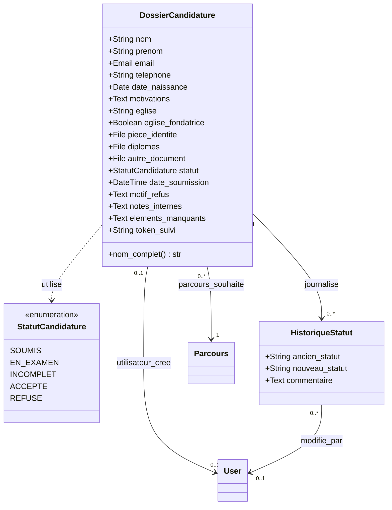
```mermaid
classDiagram
    class DossierCandidature {
        +String nom
        +String prenom
        +Email email
        +String telephone
        +Date date_naissance
        +Text motivations
        +String eglise
        +Boolean eglise_fondatrice
        +File piece_identite
        +File diplomes
        +File autre_document
        +StatutCandidature statut
        +DateTime date_soumission
        +Text motif_refus
        +Text notes_internes
        +Text elements_manquants
        +String token_suivi
        +nom_complet() str
    }

    class StatutCandidature {
        <<enumeration>>
        SOUMIS
        EN_EXAMEN
        INCOMPLET
        ACCEPTE
        REFUSE
    }

    class HistoriqueStatut {
        +String ancien_statut
        +String nouveau_statut
        +Text commentaire
    }

    DossierCandidature "1" --> "0..*" HistoriqueStatut : journalise
    DossierCandidature "0..*" --> "1" Parcours : parcours_souhaite
    DossierCandidature "0..1" --> "0..1" User : utilisateur_cree
    HistoriqueStatut "0..*" --> "0..1" User : modifie_par
    DossierCandidature ..> StatutCandidature : utilise
```

*Statut : EXISTANT. Le workflow est déjà journalisé — bonne base pour l'audit.*

### 3.4 Vie académique (`academics`)

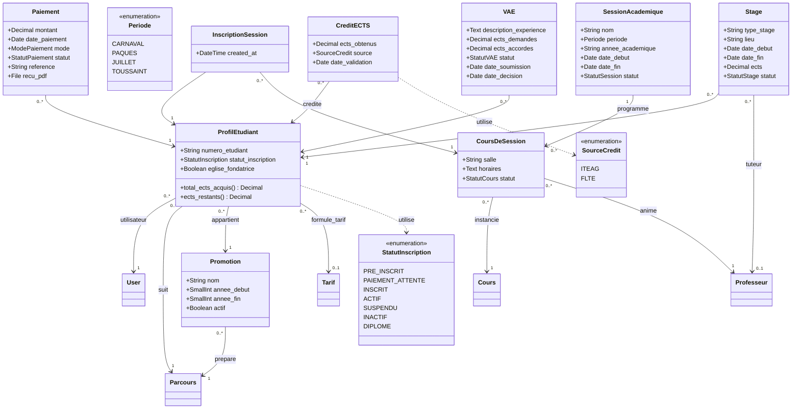
```mermaid
classDiagram
    class Promotion {
        +String nom
        +SmallInt annee_debut
        +SmallInt annee_fin
        +Boolean actif
    }

    class ProfilEtudiant {
        +String numero_etudiant
        +StatutInscription statut_inscription
        +Boolean eglise_fondatrice
        +total_ects_acquis() Decimal
        +ects_restants() Decimal
    }

    class StatutInscription {
        <<enumeration>>
        PRE_INSCRIT
        PAIEMENT_ATTENTE
        INSCRIT
        ACTIF
        SUSPENDU
        INACTIF
        DIPLOME
    }

    class SessionAcademique {
        +String nom
        +Periode periode
        +String annee_academique
        +Date date_debut
        +Date date_fin
        +StatutSession statut
    }

    class Periode {
        <<enumeration>>
        CARNAVAL
        PAQUES
        JUILLET
        TOUSSAINT
    }

    class CoursDeSession {
        +String salle
        +Text horaires
        +StatutCours statut
    }

    class InscriptionSession {
        +DateTime created_at
    }

    class CreditECTS {
        +Decimal ects_obtenus
        +SourceCredit source
        +Date date_validation
    }

    class SourceCredit {
        <<enumeration>>
        ITEAG
        FLTE
    }

    class Paiement {
        +Decimal montant
        +Date date_paiement
        +ModePaiement mode
        +StatutPaiement statut
        +String reference
        +File recu_pdf
    }

    class Stage {
        +String type_stage
        +String lieu
        +Date date_debut
        +Date date_fin
        +Decimal ects
        +StatutStage statut
    }

    class VAE {
        +Text description_experience
        +Decimal ects_demandes
        +Decimal ects_accordes
        +StatutVAE statut
        +Date date_soumission
        +Date date_decision
    }

    ProfilEtudiant "0..*" --> "1" User : utilisateur
    ProfilEtudiant "0..*" --> "1" Parcours : suit
    ProfilEtudiant "0..*" --> "1" Promotion : appartient
    ProfilEtudiant "0..*" --> "0..1" Tarif : formule_tarif
    Promotion "0..*" --> "1" Parcours : prepare
    SessionAcademique "1" --> "0..*" CoursDeSession : programme
    CoursDeSession "0..*" --> "1" Cours : instancie
    CoursDeSession "0..*" --> "1" Professeur : anime
    InscriptionSession "0..*" --> "1" ProfilEtudiant
    InscriptionSession "0..*" --> "1" CoursDeSession
    CreditECTS "0..*" --> "1" ProfilEtudiant : credite
    Paiement "0..*" --> "1" ProfilEtudiant
    Stage "0..*" --> "1" ProfilEtudiant
    Stage "0..*" --> "0..1" Professeur : tuteur
    VAE "0..*" --> "1" ProfilEtudiant
    ProfilEtudiant ..> StatutInscription : utilise
    CreditECTS ..> SourceCredit : utilise
```

*Statut : EXISTANT. Le modèle couvre fidèlement la spécificité pédagogique ITEAG
(sessions intensives, ECTS 2,5, double filière ITEAG/FLTE, stages, VAE).*

### 3.5 Pédagogie présentielle (`lms`)

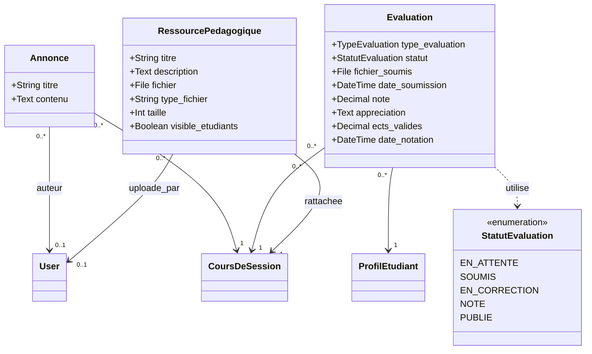
```mermaid
classDiagram
    class RessourcePedagogique {
        +String titre
        +Text description
        +File fichier
        +String type_fichier
        +Int taille
        +Boolean visible_etudiants
    }

    class Evaluation {
        +TypeEvaluation type_evaluation
        +StatutEvaluation statut
        +File fichier_soumis
        +DateTime date_soumission
        +Decimal note
        +Text appreciation
        +Decimal ects_valides
        +DateTime date_notation
    }

    class StatutEvaluation {
        <<enumeration>>
        EN_ATTENTE
        SOUMIS
        EN_CORRECTION
        NOTE
        PUBLIE
    }

    class Annonce {
        +String titre
        +Text contenu
    }

    RessourcePedagogique "0..*" --> "1" CoursDeSession : rattachee
    RessourcePedagogique "0..*" --> "0..1" User : uploade_par
    Evaluation "0..*" --> "1" ProfilEtudiant
    Evaluation "0..*" --> "1" CoursDeSession
    Annonce "0..*" --> "1" CoursDeSession
    Annonce "0..*" --> "0..1" User : auteur
    Evaluation ..> StatutEvaluation : utilise
```

*Statut : EXISTANT. À ÉTENDRE : la validation d'une `Evaluation` doit générer
automatiquement un `CreditECTS` (aujourd'hui l'opération est manuelle — voir §5.3).*

### 3.6 🎬 E-learning vidéo et contrôle d'accès (`elearning`) — **NOUVEAU**

C'est le cœur de l'extension demandée. Le domaine est conçu autour de trois
responsabilités séparées :

- **Le contenu** : `ModuleFormation` → `Chapitre` → `Lecon` → `VideoAsset`
- **Le droit** : `InscriptionModule` (*entitlement*), `RegleAccesParcours`
- **La consommation** : `ProgressionLecon`, `JournalAccesVideo`, `AttestationModule`

Cette séparation garantit qu'on peut modifier la politique d'accès sans toucher au
contenu, et auditer la consommation sans polluer le modèle pédagogique.

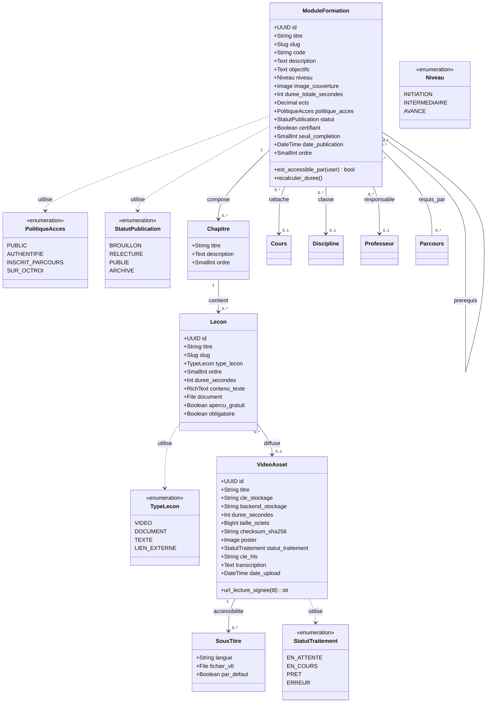
```mermaid
classDiagram
    class ModuleFormation {
        +UUID id
        +String titre
        +Slug slug
        +String code
        +Text description
        +Text objectifs
        +Niveau niveau
        +Image image_couverture
        +Int duree_totale_secondes
        +Decimal ects
        +PolitiqueAcces politique_acces
        +StatutPublication statut
        +Boolean certifiant
        +SmallInt seuil_completion
        +DateTime date_publication
        +SmallInt ordre
        +est_accessible_par(user) bool
        +recalculer_duree()
    }

    class PolitiqueAcces {
        <<enumeration>>
        PUBLIC
        AUTHENTIFIE
        INSCRIT_PARCOURS
        SUR_OCTROI
    }

    class StatutPublication {
        <<enumeration>>
        BROUILLON
        RELECTURE
        PUBLIE
        ARCHIVE
    }

    class Niveau {
        <<enumeration>>
        INITIATION
        INTERMEDIAIRE
        AVANCE
    }

    class Chapitre {
        +String titre
        +Text description
        +SmallInt ordre
    }

    class Lecon {
        +UUID id
        +String titre
        +Slug slug
        +TypeLecon type_lecon
        +SmallInt ordre
        +Int duree_secondes
        +RichText contenu_texte
        +File document
        +Boolean apercu_gratuit
        +Boolean obligatoire
    }

    class TypeLecon {
        <<enumeration>>
        VIDEO
        DOCUMENT
        TEXTE
        LIEN_EXTERNE
    }

    class VideoAsset {
        +UUID id
        +String titre
        +String cle_stockage
        +String backend_stockage
        +Int duree_secondes
        +BigInt taille_octets
        +String checksum_sha256
        +Image poster
        +StatutTraitement statut_traitement
        +String cle_hls
        +Text transcription
        +DateTime date_upload
        +url_lecture_signee(ttl) str
    }

    class StatutTraitement {
        <<enumeration>>
        EN_ATTENTE
        EN_COURS
        PRET
        ERREUR
    }

    class SousTitre {
        +String langue
        +File fichier_vtt
        +Boolean par_defaut
    }

    ModuleFormation "1" --> "0..*" Chapitre : compose
    Chapitre "1" --> "0..*" Lecon : contient
    Lecon "0..*" --> "0..1" VideoAsset : diffuse
    VideoAsset "1" --> "0..*" SousTitre : accessibilite
    ModuleFormation "0..*" --> "0..1" Cours : rattache
    ModuleFormation "0..*" --> "0..1" Discipline : classe
    ModuleFormation "0..*" --> "0..1" Professeur : responsable
    ModuleFormation "0..*" -- "0..*" Parcours : requis_par
    ModuleFormation "0..*" -- "0..*" ModuleFormation : prerequis
    ModuleFormation ..> PolitiqueAcces : utilise
    ModuleFormation ..> StatutPublication : utilise
    Lecon ..> TypeLecon : utilise
    VideoAsset ..> StatutTraitement : utilise
```

#### Droits et consommation

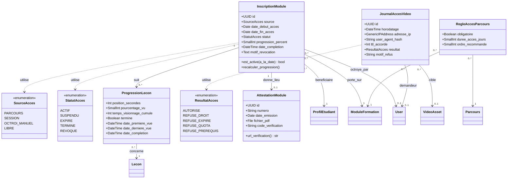
```mermaid
classDiagram
    class InscriptionModule {
        +UUID id
        +SourceAcces source
        +Date date_debut_acces
        +Date date_fin_acces
        +StatutAcces statut
        +SmallInt progression_percent
        +DateTime date_completion
        +Text motif_revocation
        +est_active(a_la_date) bool
        +recalculer_progression()
    }

    class SourceAcces {
        <<enumeration>>
        PARCOURS
        SESSION
        OCTROI_MANUEL
        LIBRE
    }

    class StatutAcces {
        <<enumeration>>
        ACTIF
        SUSPENDU
        EXPIRE
        TERMINE
        REVOQUE
    }

    class ProgressionLecon {
        +Int position_secondes
        +SmallInt pourcentage_vu
        +Int temps_visionnage_cumule
        +Boolean termine
        +DateTime date_premiere_vue
        +DateTime date_derniere_vue
        +DateTime date_completion
    }

    class JournalAccesVideo {
        +UUID id
        +DateTime horodatage
        +GenericIPAddress adresse_ip
        +String user_agent_hash
        +Int ttl_accorde
        +ResultatAcces resultat
        +String motif_refus
    }

    class ResultatAcces {
        <<enumeration>>
        AUTORISE
        REFUSE_DROIT
        REFUSE_EXPIRE
        REFUSE_QUOTA
        REFUSE_PREREQUIS
    }

    class AttestationModule {
        +UUID id
        +String numero
        +Date date_emission
        +File fichier_pdf
        +String code_verification
        +url_verification() str
    }

    class RegleAccesParcours {
        +Boolean obligatoire
        +SmallInt duree_acces_jours
        +SmallInt ordre_recommande
    }

    InscriptionModule "0..*" --> "1" ProfilEtudiant : beneficiaire
    InscriptionModule "0..*" --> "1" ModuleFormation : porte_sur
    InscriptionModule "0..*" --> "0..1" User : octroye_par
    InscriptionModule "1" --> "0..*" ProgressionLecon : suit
    InscriptionModule "1" --> "0..1" AttestationModule : donne_lieu
    ProgressionLecon "0..*" --> "1" Lecon : concerne
    JournalAccesVideo "0..*" --> "0..1" User : demandeur
    JournalAccesVideo "0..*" --> "0..1" VideoAsset : cible
    RegleAccesParcours "0..*" --> "1" Parcours
    RegleAccesParcours "0..*" --> "1" ModuleFormation
    InscriptionModule ..> SourceAcces : utilise
    InscriptionModule ..> StatutAcces : utilise
    JournalAccesVideo ..> ResultatAcces : utilise
```

#### Contraintes d'intégrité

| Contrainte | Portée | Mise en œuvre |
|-----------|--------|--------------|
| Un étudiant n'a qu'une inscription par module | `InscriptionModule` | `UniqueConstraint(etudiant, module)` |
| Une progression par couple inscription/leçon | `ProgressionLecon` | `UniqueConstraint(inscription, lecon)` |
| `date_fin_acces` ≥ `date_debut_acces` | `InscriptionModule` | `CheckConstraint` |
| `pourcentage_vu` ∈ [0, 100] | `ProgressionLecon` | `CheckConstraint` |
| `seuil_completion` ∈ [50, 100] | `ModuleFormation` | `CheckConstraint` |
| Ordre unique dans un chapitre | `Lecon` | `UniqueConstraint(chapitre, ordre)` |
| Le graphe de prérequis est acyclique | `ModuleFormation` | validation applicative (`clean()`) |
| Une leçon `VIDEO` a un `VideoAsset` | `Lecon` | validation applicative (`clean()`) |

### 3.7 Services et CMS (`library`, `documents`, `website`)

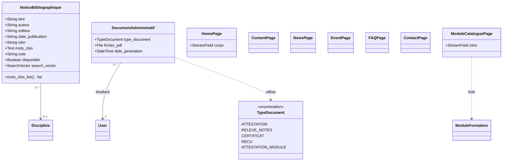
```mermaid
classDiagram
    class NoticeBibliographique {
        +String titre
        +String auteur
        +String editeur
        +String date_publication
        +String isbn
        +Text mots_cles
        +String cote
        +Boolean disponible
        +SearchVector search_vector
        +mots_cles_list() list
    }

    class DocumentAdministratif {
        +TypeDocument type_document
        +File fichier_pdf
        +DateTime date_generation
    }

    class TypeDocument {
        <<enumeration>>
        ATTESTATION
        RELEVE_NOTES
        CERTIFICAT
        RECU
        ATTESTATION_MODULE
    }

    class HomePage {
        +StreamField corps
    }
    class ContentPage
    class NewsPage
    class EventPage
    class FAQPage
    class ContactPage
    class ModuleCataloguePage {
        +StreamField intro
    }

    NoticeBibliographique "0..*" --> "0..1" Discipline
    DocumentAdministratif "0..*" --> "1" User : etudiant
    DocumentAdministratif ..> TypeDocument : utilise
    ModuleCataloguePage ..> ModuleFormation : liste
```

`ModuleCataloguePage` (NOUVEAU) est une page Wagtail éditoriale qui expose le catalogue
vidéo public : elle permet au secrétariat de rédiger l'introduction commerciale sans
développeur, tout en listant dynamiquement les modules publiés.

---

## 4. Vue processus — machines à états

### 4.1 Dossier de candidature (EXISTANT)

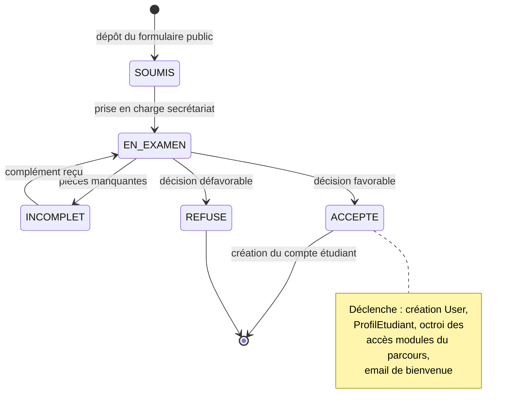
```mermaid
stateDiagram-v2
    [*] --> SOUMIS : dépôt du formulaire public
    SOUMIS --> EN_EXAMEN : prise en charge secrétariat
    EN_EXAMEN --> INCOMPLET : pièces manquantes
    INCOMPLET --> EN_EXAMEN : complément reçu
    EN_EXAMEN --> ACCEPTE : décision favorable
    EN_EXAMEN --> REFUSE : décision défavorable
    ACCEPTE --> [*] : création du compte étudiant
    REFUSE --> [*]

    note right of ACCEPTE
        Déclenche : création User,
        ProfilEtudiant, octroi des
        accès modules du parcours,
        email de bienvenue
    end note
```

### 4.2 Inscription de l'étudiant (EXISTANT)

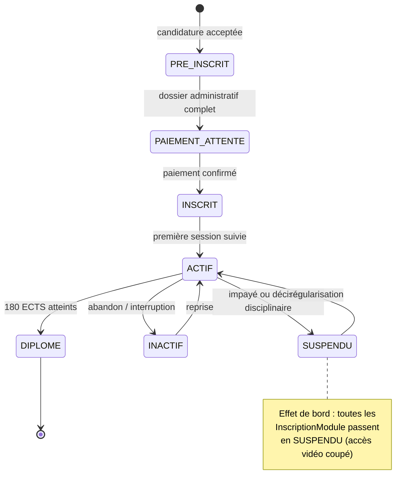
```mermaid
stateDiagram-v2
    [*] --> PRE_INSCRIT : candidature acceptée
    PRE_INSCRIT --> PAIEMENT_ATTENTE : dossier administratif complet
    PAIEMENT_ATTENTE --> INSCRIT : paiement confirmé
    INSCRIT --> ACTIF : première session suivie
    ACTIF --> SUSPENDU : impayé ou décision disciplinaire
    SUSPENDU --> ACTIF : régularisation
    ACTIF --> INACTIF : abandon / interruption
    INACTIF --> ACTIF : reprise
    ACTIF --> DIPLOME : 180 ECTS atteints
    DIPLOME --> [*]

    note right of SUSPENDU
        Effet de bord : toutes les
        InscriptionModule passent
        en SUSPENDU (accès vidéo coupé)
    end note
```

### 4.3 Accès à un module — `InscriptionModule` (**NOUVEAU**)

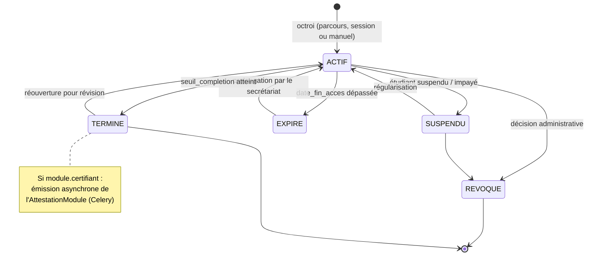
```mermaid
stateDiagram-v2
    [*] --> ACTIF : octroi (parcours, session ou manuel)
    ACTIF --> SUSPENDU : étudiant suspendu / impayé
    SUSPENDU --> ACTIF : régularisation
    ACTIF --> EXPIRE : date_fin_acces dépassée
    EXPIRE --> ACTIF : prolongation par le secrétariat
    ACTIF --> TERMINE : seuil_completion atteint
    TERMINE --> ACTIF : réouverture pour révision
    ACTIF --> REVOQUE : décision administrative
    SUSPENDU --> REVOQUE
    REVOQUE --> [*]
    TERMINE --> [*]

    note right of TERMINE
        Si module.certifiant :
        émission asynchrone de
        l'AttestationModule (Celery)
    end note
```

**Seul l'état `ACTIF` autorise la lecture d'une vidéo.** `TERMINE` autorise la relecture
si `module.autorise_revision` ; tous les autres états refusent l'accès.

### 4.4 Cycle de vie d'un `VideoAsset` (**NOUVEAU**)

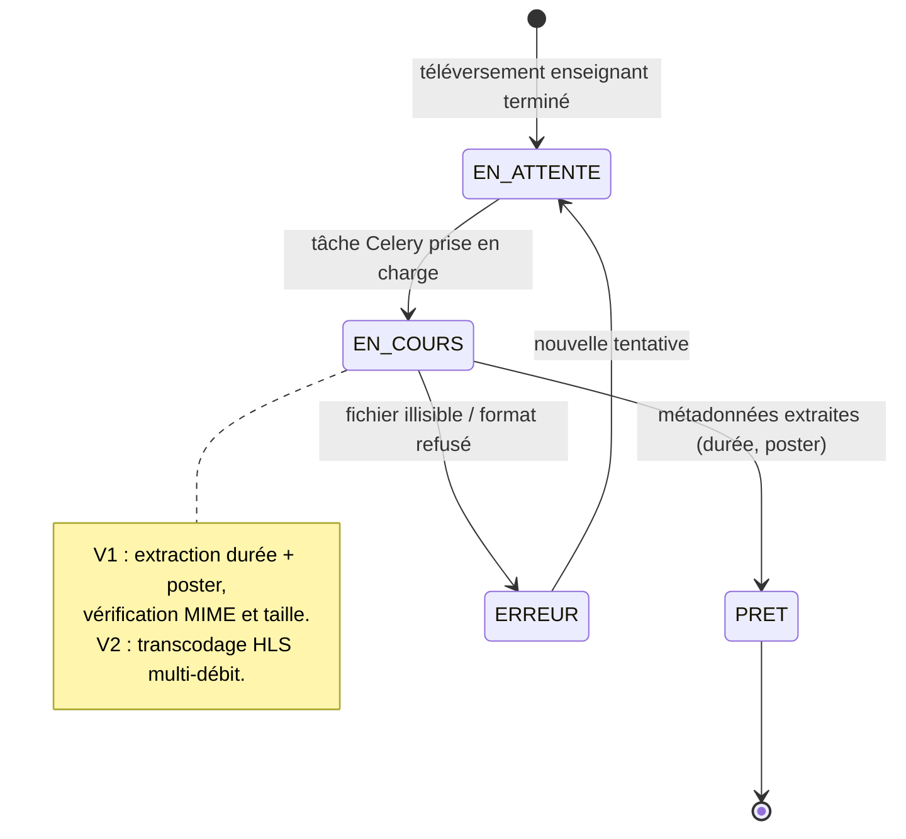
```mermaid
stateDiagram-v2
    [*] --> EN_ATTENTE : téléversement enseignant terminé
    EN_ATTENTE --> EN_COURS : tâche Celery prise en charge
    EN_COURS --> PRET : métadonnées extraites (durée, poster)
    EN_COURS --> ERREUR : fichier illisible / format refusé
    ERREUR --> EN_ATTENTE : nouvelle tentative
    PRET --> [*]

    note right of EN_COURS
        V1 : extraction durée + poster,
        vérification MIME et taille.
        V2 : transcodage HLS multi-débit.
    end note
```

Une leçon dont la vidéo n'est pas `PRET` **n'est pas publiable** : la contrainte est
vérifiée au passage de `ModuleFormation` en `PUBLIE`.

### 4.5 Évaluation (EXISTANT, à étendre)

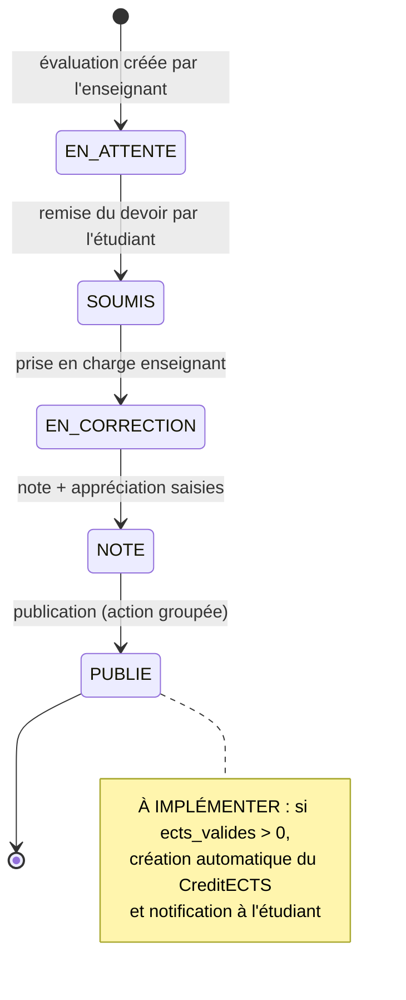
```mermaid
stateDiagram-v2
    state "NOTE" as NOTEE
    [*] --> EN_ATTENTE : évaluation créée par l'enseignant
    EN_ATTENTE --> SOUMIS : remise du devoir par l'étudiant
    SOUMIS --> EN_CORRECTION : prise en charge enseignant
    EN_CORRECTION --> NOTEE : note + appréciation saisies
    NOTEE --> PUBLIE : publication (action groupée)
    PUBLIE --> [*]

    note right of PUBLIE
        À IMPLÉMENTER : si ects_valides > 0,
        création automatique du CreditECTS
        et notification à l'étudiant
    end note
```

---

## 5. Vue processus — diagrammes de séquence

### 5.1 🔐 Lecture sécurisée d'une vidéo (**NOUVEAU — scénario critique**)

C'est le scénario le plus sensible du système : il conditionne la valeur commerciale
du contenu. Aucune URL de fichier n'est jamais présente dans le HTML servi.

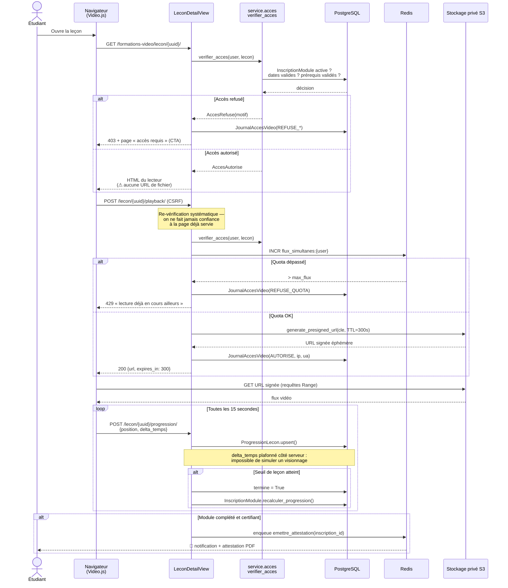
```mermaid
sequenceDiagram
    actor E as Étudiant
    participant N as Navigateur<br/>(Video.js)
    participant V as LeconDetailView
    participant S as service.acces<br/>verifier_acces
    participant DB as PostgreSQL
    participant R as Redis
    participant S3 as Stockage privé S3

    E->>N: Ouvre la leçon
    N->>V: GET /formations-video/lecon/{uuid}/
    V->>S: verifier_acces(user, lecon)
    S->>DB: InscriptionModule active ?<br/>dates valides ? prérequis validés ?
    DB-->>S: décision
    alt Accès refusé
        S-->>V: AccesRefuse(motif)
        V->>DB: JournalAccesVideo(REFUSE_*)
        V-->>N: 403 + page « accès requis » (CTA)
    else Accès autorisé
        S-->>V: AccesAutorise
        V-->>N: HTML du lecteur<br/>(⚠ aucune URL de fichier)
    end

    N->>V: POST /lecon/{uuid}/playback/ (CSRF)
    Note over V: Re-vérification systématique —<br/>on ne fait jamais confiance<br/>à la page déjà servie
    V->>S: verifier_acces(user, lecon)
    V->>R: INCR flux_simultanes:{user}
    alt Quota dépassé
        R-->>V: > max_flux
        V->>DB: JournalAccesVideo(REFUSE_QUOTA)
        V-->>N: 429 « lecture déjà en cours ailleurs »
    else Quota OK
        V->>S3: generate_presigned_url(cle, TTL=300s)
        S3-->>V: URL signée éphémère
        V->>DB: JournalAccesVideo(AUTORISE, ip, ua)
        V-->>N: 200 {url, expires_in: 300}
    end

    N->>S3: GET URL signée (requêtes Range)
    S3-->>N: flux vidéo

    loop Toutes les 15 secondes
        N->>V: POST /lecon/{uuid}/progression/<br/>{position, delta_temps}
        V->>DB: ProgressionLecon.upsert()
        Note over V,DB: delta_temps plafonné côté serveur :<br/>impossible de simuler un visionnage
        alt Seuil de leçon atteint
            V->>DB: termine = True
            V->>DB: InscriptionModule.recalculer_progression()
        end
    end

    alt Module complété et certifiant
        V->>R: enqueue emettre_attestation(inscription_id)
        R-->>E: 📧 notification + attestation PDF
    end
```

**Propriétés de sécurité obtenues :**

| Menace | Contre-mesure |
|--------|--------------|
| Partage de l'URL de la vidéo | URL signée à durée de vie 5 min, liée à la requête |
| Accès direct au bucket | Bucket privé, aucune ACL publique, pas de CDN ouvert |
| Contournement de la page | Re-vérification du droit à chaque demande de lecture |
| Partage de compte | Quota de flux simultanés (Redis) + détection multi-IP (journal) |
| Falsification de la progression | Progression calculée serveur, delta temporel plafonné |
| Aspiration automatisée | Rate limiting par utilisateur + journal d'accès exploitable |
| Accès après révocation | Aucun état persistant côté client : la révocation est immédiate |

### 5.2 Admission → création de compte → octroi des accès (EXISTANT, à étendre)

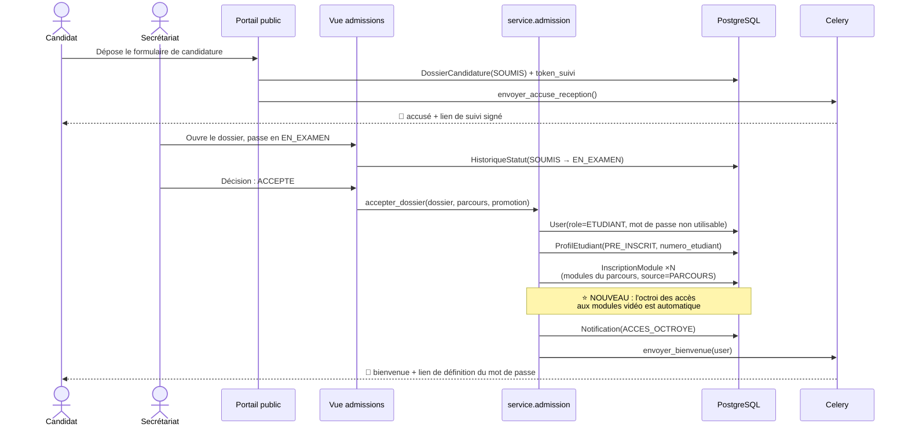
```mermaid
sequenceDiagram
    actor C as Candidat
    actor SEC as Secrétariat
    participant W as Portail public
    participant A as Vue admissions
    participant SVC as service.admission
    participant DB as PostgreSQL
    participant CEL as Celery

    C->>W: Dépose le formulaire de candidature
    W->>DB: DossierCandidature(SOUMIS) + token_suivi
    W->>CEL: envoyer_accuse_reception()
    CEL-->>C: 📧 accusé + lien de suivi signé

    SEC->>A: Ouvre le dossier, passe en EN_EXAMEN
    A->>DB: HistoriqueStatut(SOUMIS → EN_EXAMEN)

    SEC->>A: Décision : ACCEPTE
    A->>SVC: accepter_dossier(dossier, parcours, promotion)
    SVC->>DB: User(role=ETUDIANT, mot de passe non utilisable)
    SVC->>DB: ProfilEtudiant(PRE_INSCRIT, numero_etudiant)
    SVC->>DB: InscriptionModule ×N<br/>(modules du parcours, source=PARCOURS)
    Note over SVC,DB: ⭐ NOUVEAU : l'octroi des accès<br/>aux modules vidéo est automatique
    SVC->>DB: Notification(ACCES_OCTROYE)
    SVC->>CEL: envoyer_bienvenue(user)
    CEL-->>C: 📧 bienvenue + lien de définition du mot de passe
```

### 5.3 Correction d'un devoir et validation des ECTS (à étendre)

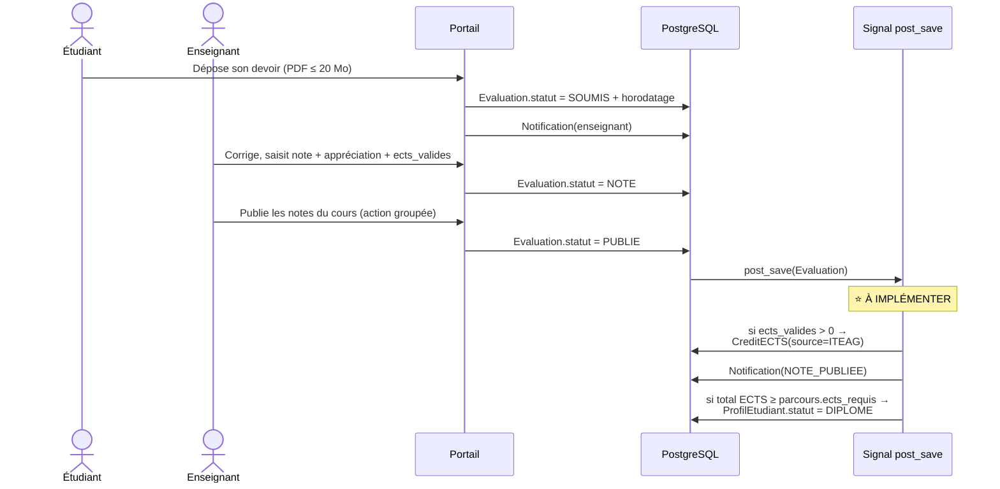
```mermaid
sequenceDiagram
    actor ETU as Étudiant
    actor ENS as Enseignant
    participant P as Portail
    participant DB as PostgreSQL
    participant SIG as Signal post_save

    ETU->>P: Dépose son devoir (PDF ≤ 20 Mo)
    P->>DB: Evaluation.statut = SOUMIS + horodatage
    P->>DB: Notification(enseignant)

    ENS->>P: Corrige, saisit note + appréciation + ects_valides
    P->>DB: Evaluation.statut = NOTE

    ENS->>P: Publie les notes du cours (action groupée)
    P->>DB: Evaluation.statut = PUBLIE
    DB->>SIG: post_save(Evaluation)
    Note over SIG: ⭐ À IMPLÉMENTER
    SIG->>DB: si ects_valides > 0 →<br/>CreditECTS(source=ITEAG)
    SIG->>DB: Notification(NOTE_PUBLIEE)
    SIG->>DB: si total ECTS ≥ parcours.ects_requis →<br/>ProfilEtudiant.statut = DIPLOME
```

### 5.4 Téléversement d'une vidéo par l'enseignant (**NOUVEAU**)

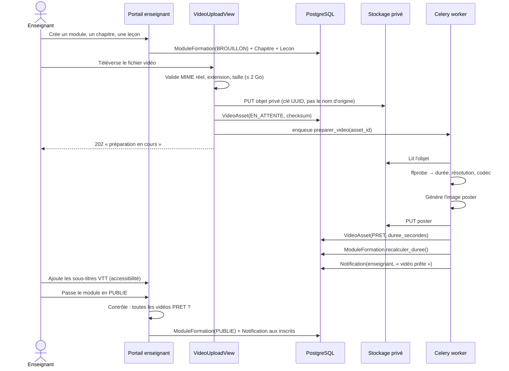
```mermaid
sequenceDiagram
    actor ENS as Enseignant
    participant P as Portail enseignant
    participant U as VideoUploadView
    participant DB as PostgreSQL
    participant S3 as Stockage privé
    participant CEL as Celery worker

    ENS->>P: Crée un module, un chapitre, une leçon
    P->>DB: ModuleFormation(BROUILLON) + Chapitre + Lecon
    ENS->>U: Téléverse le fichier vidéo
    U->>U: Valide MIME réel, extension, taille (≤ 2 Go)
    U->>S3: PUT objet privé (clé UUID, pas le nom d'origine)
    U->>DB: VideoAsset(EN_ATTENTE, checksum)
    U->>CEL: enqueue preparer_video(asset_id)
    U-->>ENS: 202 « préparation en cours »

    CEL->>S3: Lit l'objet
    CEL->>CEL: ffprobe → durée, résolution, codec
    CEL->>CEL: Génère l'image poster
    CEL->>S3: PUT poster
    CEL->>DB: VideoAsset(PRET, duree_secondes)
    CEL->>DB: ModuleFormation.recalculer_duree()
    CEL->>DB: Notification(enseignant, « vidéo prête »)

    ENS->>P: Ajoute les sous-titres VTT (accessibilité)
    ENS->>P: Passe le module en PUBLIE
    P->>P: Contrôle : toutes les vidéos PRET ?
    P->>DB: ModuleFormation(PUBLIE) + Notification aux inscrits
```

---

## 6. Vue physique — composants et déploiement

### 6.1 Diagramme de composants

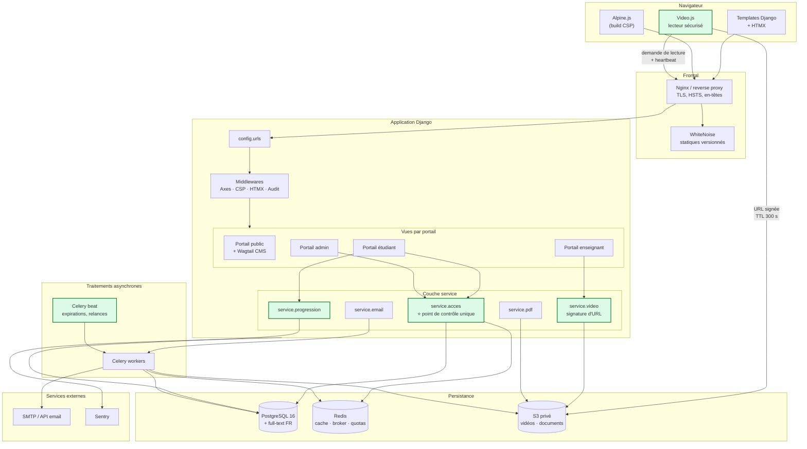
```mermaid
graph TB
    subgraph CLIENT["Navigateur"]
        HTML["Templates Django<br/>+ HTMX"]
        ALP["Alpine.js<br/>(build CSP)"]
        VJS["Video.js<br/>lecteur sécurisé"]
    end

    subgraph EDGE["Frontal"]
        NGX["Nginx / reverse proxy<br/>TLS, HSTS, en-têtes"]
        WN["WhiteNoise<br/>statiques versionnés"]
    end

    subgraph APP["Application Django"]
        URLS["config.urls"]
        subgraph PORTALS["Vues par portail"]
            PUB["Portail public<br/>+ Wagtail CMS"]
            PETU["Portail étudiant"]
            PENS["Portail enseignant"]
            PADM["Portail admin"]
        end
        subgraph SVCS["Couche service"]
            SACC["service.acces<br/>⭐ point de contrôle unique"]
            SVID["service.video<br/>signature d'URL"]
            SPROG["service.progression"]
            SMAIL["service.email"]
            SPDF["service.pdf"]
        end
        MW["Middlewares<br/>Axes · CSP · HTMX · Audit"]
    end

    subgraph ASYNC["Traitements asynchrones"]
        CEL["Celery workers"]
        BEAT["Celery beat<br/>expirations, relances"]
    end

    subgraph DATA["Persistance"]
        PG[("PostgreSQL 16<br/>+ full-text FR")]
        RDS[("Redis<br/>cache · broker · quotas")]
        S3[("S3 privé<br/>vidéos · documents")]
    end

    subgraph EXT["Services externes"]
        MAIL["SMTP / API email"]
        SEN["Sentry"]
    end

    HTML --> NGX
    ALP --> NGX
    VJS -->|"URL signée<br/>TTL 300 s"| S3
    VJS -->|"demande de lecture<br/>+ heartbeat"| NGX
    NGX --> WN
    NGX --> URLS
    URLS --> MW --> PORTALS
    PETU --> SACC & SPROG
    PENS --> SVID
    PADM --> SACC
    SACC --> PG & RDS
    SVID --> S3
    SPROG --> PG
    SMAIL --> CEL
    SPDF --> S3
    CEL --> PG & RDS & S3 & MAIL
    BEAT --> CEL
    APP --> SEN

    classDef nouveau fill:#DCFCE7,stroke:#15803D,stroke-width:2px
    class VJS,SACC,SVID,SPROG,BEAT nouveau
```

### 6.2 Diagramme de déploiement

```mermaid
graph TB
    subgraph INTERNET["Internet"]
        USR["Postes et mobiles<br/>Guadeloupe · Martinique · Guyane"]
    end

    subgraph VPS["Serveur applicatif — Docker Compose"]
        subgraph C1["conteneur: web"]
            GUN["Gunicorn 3 workers<br/>config.settings.prod"]
        end
        subgraph C2["conteneur: worker"]
            CELW["Celery worker"]
        end
        subgraph C3["conteneur: beat"]
            CELB["Celery beat"]
        end
        subgraph C4["conteneur: db"]
            PGD[("PostgreSQL 16")]
        end
        subgraph C5["conteneur: cache"]
            RD[("Redis 7")]
        end
        subgraph C6["conteneur: proxy"]
            NG["Nginx + Let's Encrypt"]
        end
    end

    subgraph CLOUD["Services managés"]
        S3B[("Bucket S3 privé<br/>eu-west-3")]
        SMTP["Service email<br/>transactionnel"]
        SENT["Sentry"]
        BAK[("Sauvegardes chiffrées<br/>RPO 24 h · RTO 4 h")]
    end

    USR -->|HTTPS| NG
    NG --> GUN
    GUN --> PGD & RD
    CELW --> PGD & RD & S3B & SMTP
    CELB --> RD
    GUN --> S3B
    USR -.->|"URL signée éphémère"| S3B
    PGD -->|"pg_dump quotidien"| BAK
    S3B -->|versioning| BAK
    GUN --> SENT

    classDef nouveau fill:#DCFCE7,stroke:#15803D,stroke-width:2px
    class C3,BAK nouveau
```

---

## 7. Modèle de sécurité — défense en profondeur

L'accès à un contenu protégé traverse **six couches** ; chacune peut refuser seule.

```mermaid
graph LR
    R["Requête"] --> L1
    L1["1 · Transport<br/>TLS · HSTS · CSP"] --> L2
    L2["2 · Authentification<br/>session · Axes · 2FA staff"] --> L3
    L3["3 · Autorisation RBAC<br/>RoleRequiredMixin"] --> L4
    L4["4 · Droit métier<br/>verifier_acces()"] --> L5
    L5["5 · Ressource<br/>URL signée · bucket privé"] --> L6
    L6["6 · Traçabilité<br/>journal · quotas · alertes"] --> OK["Contenu servi"]

    L2 -.->|401| KO["Refus journalisé"]
    L3 -.->|403| KO
    L4 -.->|403| KO
    L5 -.->|410| KO
    L6 -.->|429| KO

    classDef layer fill:#F1F5F9,stroke:#475569
    classDef deny fill:#FEE2E2,stroke:#B91C1C
    class L1,L2,L3,L4,L5,L6 layer
    class KO deny
```

### 7.1 Matrice des droits

| Ressource | Visiteur | Candidat | Étudiant | Enseignant | Secrétariat | Admin |
|-----------|:--------:|:--------:|:--------:|:----------:|:-----------:|:-----:|
| Catalogue des modules (fiches) | ✅ | ✅ | ✅ | ✅ | ✅ | ✅ |
| Leçon marquée « aperçu gratuit » | ✅ | ✅ | ✅ | ✅ | ✅ | ✅ |
| Vidéo d'un module (`SUR_OCTROI`) | ❌ | ❌ | ⚠️ si `InscriptionModule` active | ✅ si responsable | ✅ | ✅ |
| Progression d'un étudiant | ❌ | ❌ | ⚠️ la sienne | ⚠️ ses modules | ✅ | ✅ |
| Création/édition d'un module | ❌ | ❌ | ❌ | ⚠️ les siens | ❌ | ✅ |
| Octroi/révocation d'accès | ❌ | ❌ | ❌ | ❌ | ✅ | ✅ |
| Journal d'accès vidéo | ❌ | ❌ | ❌ | ❌ | ⚠️ ses cohortes | ✅ |

### 7.2 Point de contrôle unique

Toute la logique d'autorisation métier est concentrée dans **une seule fonction** :

```python
# apps/elearning/services/acces.py
def verifier_acces(user, lecon) -> DecisionAcces:
    """Autorité unique du système sur l'accès à un contenu pédagogique.

    Retourne une DecisionAcces (autorise: bool, motif: ResultatAcces).
    Toute vue, tout endpoint et toute tâche DOIT passer par ici.
    """
```

Aucune vue ne réimplémente cette règle. C'est ce qui rend le contrôle d'accès
**testable exhaustivement** (une table de vérité, un test par ligne) et **auditable**.

---

## 8. Traçabilité — exigences CDC ↔ modèle

| ID CDC | Exigence | Couverture | Éléments de modèle |
|--------|----------|-----------|-------------------|
| PUB-003/004 | Catalogue et fiches formation | ✅ Existant | `Parcours`, `Cours` |
| PUB-012 | Newsletter double opt-in | ❌ Manquant | `AbonneNewsletter` |
| PUB-014 | Bibliothèque publique | ✅ Existant | `NoticeBibliographique` |
| ETU-002 | Tableau de bord | ✅ Existant | vues `academics` |
| ETU-003 | Accès cours et ressources | ✅ Existant | `RessourcePedagogique` |
| ETU-009 | Notifications internes | ❌ Manquant | `Notification` |
| ENS-002 | Upload de contenus | ⚠️ Partiel | `RessourcePedagogique` → étendu par `VideoAsset` |
| ADM-005 | Utilisateurs et rôles | ✅ Existant | `User.Role` |
| ADM-007 | Reporting | ⚠️ Partiel | à compléter (KPI vidéo) |
| BIB-004 | Import CSV du catalogue | ❌ Manquant | commande `import_notices` |
| **NOUVEAU** | Formation vidéo à distance | ❌ À créer | `ModuleFormation`, `Chapitre`, `Lecon`, `VideoAsset` |
| **NOUVEAU** | Accès sécurisé aux modules | ❌ À créer | `InscriptionModule`, `verifier_acces()`, `JournalAccesVideo` |
| **NOUVEAU** | Attestation de module | ❌ À créer | `AttestationModule` |
| CDC §13 | Traçabilité et audit | ❌ Manquant | `JournalAudit` |
| CDC §14 | Accessibilité WCAG 2.2 AA | ⚠️ Partiel | `SousTitre`, `transcription` |

---

## 9. Décisions d'architecture

Les décisions structurantes sont consignées séparément, au format ADR :

| ADR | Sujet |
|-----|-------|
| [ADR-001](adr/ADR-001-diffusion-video-securisee.md) | Stratégie de diffusion vidéo et de stockage |
| [ADR-002](adr/ADR-002-controle-acces-modules.md) | Modèle de contrôle d'accès aux modules |
| [ADR-003](adr/ADR-003-csp-et-alpine.md) | Politique CSP et build Alpine.js |
| [ADR-004](adr/ADR-004-pipeline-assets-production.md) | Chaîne de production des assets |

---

*Document de conception — Trait d'Union Studio pour l'ITEAG.*
