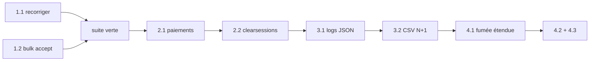

# Plan de correction — suite à l'audit du 2026-08-03

**Référence** : rapport d'audit en lecture seule du 2026-08-03 (constats reproduits par tests jetables hors dépôt).
**Principe** : aucun lot n'est déclaré terminé sans `ruff check .`, `ruff format --check .` et suite pytest verts. Chaque tâche = un commit isolé avec son test.

---

## LOT 1 — Défauts qui produisent des données fausses ou irréparables

### 1.1 Recorrection d'une note publiée *(constat n° 1 — Majeur)*

**Le défaut constaté** : `recorriger()` réécrit une note déjà publiée (0,00 → 20,00 reproduit), sans `RevisionNote`, sans motif, sans notification à l'étudiant, en laissant `appreciation` et `date_notation` périmées.

**Fichiers** :

- `src/apps/lms/services.py` (ligne ~300, boucle `devoir.copies.exclude(statut=EN_ATTENTE)`)
- `src/apps/lms/test_qcm_groupes.py`

**À faire** :

1. Router les copies **publiées** vers `reviser()` avec un motif automatique (« recorrection après modification du barème ») → trace `RevisionNote`, notification à l'étudiant, appréciation mise à jour.
2. Pour les copies **non publiées**, recalculer `appreciation` et `date_notation` dans le même `update_fields` (élimine la fiche auto-contradictoire « 20,00 » à côté de « 0 / 3,00 points »).

**Tests à ajouter** :

- copie `PUBLIE` + recorrection → `RevisionNote` créée + notification émise + appréciation cohérente ;
- copie `NOTE` + recorrection → note, appréciation **et** `date_notation` cohérentes entre elles.

**Critère d'acceptation** : la reproduction de l'audit (note publiée écrasée sans trace) devient impossible ; suite verte.

---

### 1.2 Acceptation groupée sans création de compte *(constat n° 2 — Majeur)*

**Le défaut constaté** : `BulkCandidatureStatusView` fait passer un dossier à `accepte` via `transition_dossier()` sans jamais appeler `accepter_dossier()` → aucun compte créé, et le dossier est définitivement bloqué (`ACCEPTE` est terminal, le rattrapage depuis la fiche échoue). La vue n'a aucun bouton dans le gabarit : code mort armé.

**Fichiers** :

- `src/apps/administration/views.py` (ligne ~1003, `BulkCandidatureStatusView`)
- `src/apps/administration/urls.py` (route `candidatures_bulk_status`)
- `src/templates/administration/candidatures.html` (formulaire d'action groupée à ajouter)
- `src/apps/core/test_fumee.py` (liste `EXCLUES`)

**À faire** :

1. Router `statut == ACCEPTE` vers `accepter_dossier()` **par dossier** dans `BulkCandidatureStatusView.post` (une transaction par dossier, pas globale — un échec ne doit pas annuler les autres).
2. Ajouter au gabarit `candidatures.html` le formulaire d'action groupée manquant (cases à cocher + soumission vers `administration:candidatures_bulk_status`), pour que la vue cesse d'être du code mort.
3. Retirer `candidatures_bulk_status` de la liste `EXCLUES` du test de fumée et couvrir la route.
4. Écrire une commande de gestion idempotente qui détecte les dossiers `accepte` avec `utilisateur_cree IS NULL` et rejoue la provision de compte sur chacun (pas de shell manuel), puis l'exécuter sur la production.

**Tests à ajouter** : POST groupé avec `accepte` → un compte créé par dossier + `utilisateur_cree` renseigné ; échec sur un dossier → les autres restent traités ; commande de rattrapage → idempotente (deux exécutions successives, même résultat).

**Critère d'acceptation** : aucun dossier ne peut plus atteindre `accepte` sans compte ; les reproductions [A] et [A2] de l'audit échouent.

---

## LOT 2 — Sécurité et données personnelles

### 2.1 Purge des sessions expirées *(constat n° 5 — Mineur)*

**Le défaut constaté** : sessions en base + `SESSION_SAVE_EVERY_REQUEST = True` + aucune occurrence de `clearsessions` dans le dépôt → `django_session` croît sans borne.

**Fichiers** :

- `src/apps/core/tasks.py` (ou module de tâches équivalent)
- `src/config/settings/base.py` (`CELERY_BEAT_SCHEDULE`, ligne ~388)

**À faire** :

1. Créer une tâche Celery appelant `call_command("clearsessions")`.
2. L'inscrire dans `CELERY_BEAT_SCHEDULE` en quotidien à heure creuse (p. ex. 04 h).

**Test à ajouter** : la tâche supprime une session expirée insérée manuellement et préserve une session valide.

**Critère d'acceptation** : `clearsessions` branché sur beat ; test vert.

---

## LOT 3 — Exploitation et observabilité

### 3.1 Format de journal JSON de production *(constat n° 3 — Mineur)*

**Le défaut constaté** : le formateur « json » de `prod.py` est une chaîne à trous — un guillemet dans un message réel casse le JSON, et `logger.exception` émet la trace **après** l'accolade fermante (5 lignes reproduites).

**Fichier** : `src/config/settings/prod.py` (LOGGING, lignes ~113-137).

**À faire** :

1. Écrire une classe `JsonFormatter(logging.Formatter)` (~10 lignes, sans dépendance externe) construisant un dict (`time`, `level`, `name`, `message`, `exc_info` sérialisé dans un champ dédié) passé à `json.dumps(ensure_ascii=False)`. À placer dans `apps/core/` (ou `config/`).
2. Brancher ce formateur sur le handler `console` de `prod.py` à la place de la chaîne à trous.

**Tests à ajouter** : message contenant `"` et retour ligne → `json.loads` réussit ; `logger.exception` → une seule ligne, trace dans le champ dédié.

**Contrainte de séquencement** : impérativement livré avant tout branchement d'une chaîne d'agrégation de journaux.

---

### 3.2 Export CSV des étudiants — requête N+1 *(constat n° 6 — Remarque)*

**Le défaut constaté** : `ExportEtudiantsCsvView` appelle la propriété `total_ects_acquis` dans `.iterator()` → une requête d'agrégation par étudiant. `AdminEtudiantListView` (ligne ~339) fait déjà la chose correcte avec `Coalesce(Sum(...))`.

**Fichier** : `src/apps/administration/views.py` (lignes ~941 et ~951).

**À faire** : reprendre l'annotation `Coalesce(Sum(...))` de la vue liste dans la requête d'export et lire l'annotation au lieu de la propriété.

**Test à ajouter** : `assertNumQueries` borné indépendamment du nombre d'étudiants ; valeurs identiques à celles de la propriété.

---

## LOT 4 — Dette de tests et de documentation

### 4.1 Étendre le test de fumée aux routes paramétrées *(constat n° 8 — le plus rentable du lot)*

**Le défaut constaté** : `test_fumee.py` ne retient que les routes sans argument (`groups == 0`) ; toutes les vues de détail (`<pk>`, `<slug>`, `<uuid>`) sont hors garde-fou — exactement là où se logent les défauts de cloisonnement (le constat n° 4 en est la preuve).

**Fichier** : `src/apps/core/test_fumee.py`.

**À faire** :

1. Lever la restriction `groups == 0`.
2. Construire une table de fabriques par app (`{nom_route: callable → kwargs}`) créant l'objet minimal et fournissant les arguments d'URL.
3. Pour chaque route paramétrée, vérifier : anonyme → redirection ; utilisateur **non propriétaire** du bon rôle → 403/404.
4. Faire échouer le test avec un message « fabrique manquante » pour toute route sans fabrique déclarée — c'est le mécanisme qui empêche les futures vues de détail d'échapper au garde-fou.
5. Retirer `candidatures_bulk_status` de `EXCLUES` (couverte par 1.2).

**Critère d'acceptation** : le test, rejoué sur un commit antérieur à 2.1, détecte le défaut des pages de retour de paiement.

---

### 4.2 Corriger le test tautologique *(constat n° 7 — Remarque)*

**Le défaut constaté** : `test_le_releve_de_notes_reprend_les_credits` (`src/apps/documents/test_documents.py`, ~ligne 107) annonce vérifier le contenu du relevé mais n'affirme que `status_code in (200, 302)`.

**À faire** : renforcer l'assertion — extraire le texte du PDF avec `fitz`, comme le fait déjà `test_generation_pdf.py`, et vérifier la présence des crédits réellement acquis. Le test doit garantir ce que sa docstring annonce.

---

### 4.3 Mettre à jour le plan de finalisation *(constat n° 9 — Remarque)*

**Le défaut constaté** : `docs/plan/plan-finalisation.md` présente comme « valeur constatée » un état révolu (95 tests, 232 erreurs de lint, CI rouge) alors que la réalité mesurée est ~2378 tests verts, lint à zéro, CI verte.

**À faire** :

1. Remettre le tableau « Point de départ mesuré » en cohérence avec l'état réel (~2378 tests verts, lint à zéro, CI verte).
2. Marquer les lots livrés.
3. Reporter dans ce document les tâches restantes du présent plan.

---

## Ordre d'exécution et garde-fous

1. **Toutes les tâches de ce plan sont à réaliser** — aucune n'est optionnelle ni différée. L'ordre des lots fixe la priorité, pas le périmètre.
2. **Avant fusion de chaque lot** : `ruff check .`, `ruff format --check .`, `makemigrations --check --dry-run`, suite complète. Aucune tâche de ce plan ne requiert de migration — si `makemigrations` détecte un changement, c'est un signal d'erreur.
3. **Après le lot 1** : rejouer la suite au moins une fois sur PostgreSQL (`DATABASE_URL`), puisque 1.2 touche du code sous `select_for_update` que SQLite n'éprouve pas réellement.

