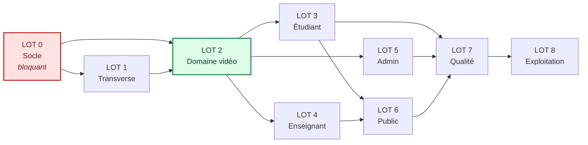

# Plan de finalisation — Plateforme ITEAG, grade commercial

**Référence conception** : [`docs/architecture/uml.md`](../architecture/uml.md)
**Objectif** : amener la plateforme d'un socle V1 fonctionnel à un produit livrable,
exploitable en production et vendable, incluant la formation vidéo à distance et le
contrôle d'accès sécurisé aux modules.

---

## 1. Point de départ et état constaté

Les deux colonnes de gauche sont des mesures, pas des estimations : la première
date de l'ouverture du plan, la seconde du **3 août 2026**, relevée sur la
branche principale (`pytest --cov=apps`, `ruff check .`, `ruff format --check .`).

| Indicateur | Au démarrage | Constaté le 2026-08-03 | Cible de livraison |
|-----------|--------------|------------------------|--------------------|
| Tests | 95, tous verts | **2 426 verts**, 3 ignorés | ≥ 200, tous verts |
| Couverture | 84 % | **92 %** | ≥ 90 % global, **100 % sur le contrôle d'accès** |
| Lint `ruff check` | **232 erreurs** | 0 | 0 |
| Format `ruff format` | **38 fichiers à reformater** | 0 | 0 |
| Intégration continue | **Rouge** (le job `lint` échoue en premier) | **Verte** | Verte |
| Build de production | **Rompu** (CSS jamais compilé) | Image construite et servie | Image déployable vérifiée |
| Apps métier | 9 | 14 | 10 (+ `elearning`) |
| Formation vidéo | Absente | Livrée | Livrée |
| Notifications, newsletter, audit | Absents | Livrés | Livrés |

> Les valeurs de la colonne « au démarrage » ont longtemps figuré ici comme
> « valeur constatée », bien après qu'elles eurent cessé de l'être. Un tableau
> d'état périmé est pire qu'absent : il est lu et cru.

## 2. Principes de conduite

1. **Aucun lot n'est déclaré terminé sans tests verts et lint propre.** La dette ne se
   reporte pas d'un lot au suivant.
2. **Le lot 0 passe avant tout.** Construire sur une intégration continue rouge revient
   à ne pas savoir ce qui casse.
3. **Chaque lot livre une valeur observable** : une fonctionnalité qu'on peut démontrer,
   pas une couche technique invisible.
4. **La sécurité du contenu vidéo est traitée dès la conception**, pas ajoutée après.
5. **Chaque tâche a un critère d'acceptation vérifiable.** Pas de « fait » déclaratif.

---

## 3. Lots de travail

### LOT 0 — Remise à niveau du socle *(bloquant)* — ✅ livré

Objet : rendre le projet déployable et l'intégration continue exploitable.

| # | Tâche | Critère d'acceptation |
|---|-------|----------------------|
| 0.1 | Corriger les 232 erreurs de lint et reformater | `ruff check .` et `ruff format --check .` sortent en 0 |
| 0.2 | Rétablir la chaîne d'assets de production (ADR-004) | Image construite, `collectstatic` réussit sans `\|\| true`, page servie avec styles |
| 0.3 | Passer Alpine en build CSP (ADR-003) | Aucune violation CSP en recette ; menus et accordéons fonctionnels |
| 0.4 | Supprimer le doublon `config/` à la racine du dépôt | Le dépôt ne contient plus qu'un seul arbre de configuration |
| 0.5 | Rédiger le `README.md` (installation, exécution, conventions) | Un développeur tiers démarre le projet sans assistance |
| 0.6 | Mettre `.plan/task/plan.md` en cohérence avec la réalité | Le tableau d'avancement reflète l'état réel |
| 0.7 | Aligner la version de Python (3.12 partout) | `pyproject.toml`, CI et Dockerfile concordent |
| 0.8 | Ajouter le test d'architecture (graphe d'imports acyclique) | Une dépendance circulaire fait échouer la suite |

**Sortie de lot** : intégration continue verte, image de production vérifiée.

---

### LOT 1 — Socle transverse — ✅ livré

Objet : fournir les briques que tous les autres lots consomment.

| # | Tâche | Critère d'acceptation |
|---|-------|----------------------|
| 1.1 | Modèle et service `Notification` (ETU-009) | Badge de compteur non lu, marquage lu, purge automatique |
| 1.2 | `JournalAudit` + middleware de traçabilité | Toute action sensible est journalisée avec IP et acteur |
| 1.3 | Service email unifié et gabarits HTML | Un seul point d'envoi, testé, asynchrone via Celery |
| 1.4 | Double authentification pour les profils staff | Connexion admin impossible sans second facteur |
| 1.5 | Newsletter avec double opt-in (PUB-012) | Inscription, confirmation, désinscription, conformité RGPD |
| 1.6 | Pages d'erreur 403/404/500 à la charte | Pages soignées, sans fuite d'information technique |
| 1.7 | Endpoint de santé `/healthz` | Retourne l'état base, cache et stockage |

---

### LOT 2 — Domaine e-learning vidéo *(cœur de l'extension)* — ✅ livré

Objet : le modèle, les règles et les services. Aucune interface à ce stade.

| # | Tâche | Critère d'acceptation |
|---|-------|----------------------|
| 2.1 | Créer l'app `elearning` et ses modèles (§3.6 UML) | Migrations appliquées, contraintes d'intégrité en base |
| 2.2 | Abstraction du stockage vidéo (ADR-001) | Deux implémentations : S3 et local ; interchangeables par réglage |
| 2.3 | `service.acces.verifier_acces()` et sa table de vérité | **11 cas de refus testés unitairement, couverture 100 %** |
| 2.4 | Service de progression avec validation serveur | Une progression falsifiée côté client est rejetée |
| 2.5 | Octroi automatique des accès à l'admission | L'acceptation d'un dossier crée les `InscriptionModule` du parcours |
| 2.6 | Propagation des états (suspension, expiration) | Suspendre un étudiant coupe l'accès vidéo dans la seconde |
| 2.7 | Tâches Celery : préparation vidéo, expiration, attestation | Vidéo passée en `PRET` avec durée et poster extraits |
| 2.8 | Administration Django des modules | Le secrétariat octroie et révoque sans développeur |

---

### LOT 3 — Portail étudiant : suivre une formation vidéo — ✅ livré

| # | Tâche | Critère d'acceptation |
|---|-------|----------------------|
| 3.1 | Catalogue « Mes formations » | Modules accessibles, progression, état d'accès lisible |
| 3.2 | Page module : chapitres, leçons, progression | Sommaire clair, leçon suivante mise en avant |
| 3.3 | **Lecteur vidéo sécurisé** (Video.js, URL signée) | Aucune URL de fichier dans le HTML ; lecture fonctionnelle |
| 3.4 | Reprise de lecture à la position quittée | Reprise à ±2 s près après reconnexion |
| 3.5 | Battement de progression et complétion serveur | Leçon marquée terminée au seuil, module recalculé |
| 3.6 | Sous-titres et transcription (accessibilité) | Piste VTT sélectionnable, transcription dépliable |
| 3.7 | Page « accès requis » lorsqu'un droit manque | Message adapté au motif de refus, appel à l'action |
| 3.8 | Attestation de module téléchargeable | PDF nominatif avec code de vérification public |

---

### LOT 4 — Portail enseignant : produire le contenu — ✅ livré

| # | Tâche | Critère d'acceptation |
|---|-------|----------------------|
| 4.1 | Création et édition d'un module | L'enseignant structure module → chapitres → leçons |
| 4.2 | Téléversement vidéo avec validation | MIME réel vérifié, taille plafonnée, retour de progression |
| 4.3 | Réordonnancement des leçons | Glisser-déposer persisté (HTMX) |
| 4.4 | Dépôt des sous-titres | Fichier VTT associé et servi au lecteur |
| 4.5 | Publication contrôlée du module | Publication refusée si une vidéo n'est pas prête |
| 4.6 | Tableau d'audience | Taux de complétion et leçons abandonnées par module |

---

### LOT 5 — Portail administratif — ✅ livré

| # | Tâche | Critère d'acceptation |
|---|-------|----------------------|
| 5.1 | Gestion des accès aux modules | Octroi, prolongation, suspension, révocation en masse |
| 5.2 | Vue « qui a accès à quoi » | Filtres par module, parcours, promotion, statut |
| 5.3 | Statistiques de visionnage | Heures vues, complétion, modules les plus suivis |
| 5.4 | Journal d'accès consultable | Détection des accès multi-IP suspects |
| 5.5 | Exports CSV étendus | Accès, progressions, attestations |
| 5.6 | Tableau de bord des indicateurs métier | Conversion, complétion, impayés (CDC §17) |

---

### LOT 6 — Portail public : vendre la formation — ✅ livré

| # | Tâche | Critère d'acceptation |
|---|-------|----------------------|
| 6.1 | Catalogue public des modules vidéo | Fiches attractives, durée, niveau, enseignant |
| 6.2 | Aperçu gratuit d'une leçon | Lecture sans compte, appel à l'action visible |
| 6.3 | Page Wagtail éditoriale du catalogue | Le secrétariat rédige l'introduction sans développeur |
| 6.4 | Données structurées `Course` et `VideoObject` | Validation par l'outil de test de Google |
| 6.5 | Parcours de conversion visiteur → candidature | Chemin mesurable de bout en bout |

---

### LOT 7 — Qualité, accessibilité, performance — ✅ livré

| # | Tâche | Critère d'acceptation |
|---|-------|----------------------|
| 7.1 | Porter la couverture à ≥ 90 % | Rapport de couverture à l'appui |
| 7.2 | Tests des vues non couvertes (`lms`, `documents`, `website`) | Chaque vue a au moins un test de contrôle d'accès |
| 7.3 | Audit d'accessibilité WCAG 2.2 AA | Navigation clavier, contrastes, libellés, lecteur vidéo |
| 7.4 | Budget de performance | Lighthouse > 90, LCP < 2,5 s sur les pages clés |
| 7.5 | Revue de sécurité | `pip-audit` propre, en-têtes vérifiés, `check --deploy` sans alerte |
| 7.6 | Optimisation des requêtes | Aucune requête N+1 sur les listes principales |

---

### LOT 8 — Mise en exploitation — ✅ livré au dépôt, reste à éprouver en production

| # | Tâche | Critère d'acceptation |
|---|-------|----------------------|
| 8.1 | Import CSV du catalogue bibliothèque (BIB-004) | Les 2 635 notices importées et cherchables |
| 8.2 | Migration du contenu éditorial | 12 pages, actualités et images reprises |
| 8.3 | Redirections 301 depuis l'ancien site (PUB-015) | Aucune URL entrante en 404 |
| 8.4 | Sauvegardes et restauration (RPO 24 h / RTO 4 h) | Restauration testée et chronométrée |
| 8.5 | Supervision et alertes | Sentry actif, alerte sur taux d'erreur |
| 8.6 | Documentation d'exploitation et de reprise | Un exploitant tiers peut reprendre la main |
| 8.7 | Guides utilisateur par rôle | Livrables L01 à L09 du CDC |

---

### LOT 9 — Correction d'audit *(2026-08-03)*

Objet : les défauts relevés par l'audit en lecture seule du 3 août 2026. Le
détail, les reproductions et les critères d'acceptation vivent dans
[`plan-correction-audit.md`](plan-correction-audit.md) ; ce tableau n'en tient
que le décompte.

| # | Tâche | État |
|---|-------|------|
| 9.1 | Recorrection d'une note publiée : révision tracée et notifiée | ✅ livré |
| 9.2 | Acceptation groupée : création du compte, gabarit, commande de rattrapage | ✅ livré |
| 9.3 | Cloisonnement des pages de retour de paiement | ✅ livré |
| 9.4 | Purge quotidienne des sessions expirées | ✅ livré |
| 9.5 | Formateur JSON du journal de production | ✅ livré |
| 9.6 | Export CSV des étudiants : suppression du N+1 | ✅ livré |
| 9.7 | Test de fumée étendu aux 147 routes à paramètre | ✅ livré |
| 9.8 | Relevé de notes : assertion sur le contenu du PDF | ✅ livré |
| 9.9 | Remise à jour du présent plan | ✅ livré |

**Reste à faire, hors dépôt** — ces deux points ne se ferment pas depuis le
code et demandent un accès aux environnements :

- exécuter `python manage.py rattraper_comptes_acceptes` en production, après
  un passage `--simuler`, pour les dossiers déjà marqués « accepté » sans
  compte (tâche 1.2 du plan de correction) ;
- rejouer la suite complète sur PostgreSQL, ce que l'intégration continue fait
  à chaque poussée : la vérification locale s'est faite sur SQLite, faute de
  service PostgreSQL sur le poste.

---

## 4. Ordonnancement et dépendances

Le **lot 2 est le chemin critique** : trois lots en dépendent directement. Tout retard
s'y propage. C'est pourquoi il est traité immédiatement après la remise à niveau, et non
en parallèle d'interfaces qui n'auraient rien à consommer.

---

## 5. Risques et parades

| # | Risque | Impact | Parade |
|---|--------|--------|--------|
| R1 | Le contenu vidéo fuite malgré les protections | Perte de valeur commerciale | ADR-001 : URL éphémères, quotas, journal exploitable. Le risque résiduel (capture d'écran) est assumé et documenté |
| R2 | Volume vidéo supérieur aux prévisions | Coût de stockage et de trafic | Mesure dès la mise en service ; bascule HLS + CDN prévue sans refonte |
| R3 | Progression falsifiée pour obtenir une attestation | Crédibilité du diplôme | Validation serveur, plafonnement du delta temporel, journal d'accès |
| R4 | Débit insuffisant en Guyane et Martinique | Abandon des étudiants distants | Vidéos 720p plafonnées ; téléchargement des supports en complément |
| R5 | Contenus et médias non fournis par l'ITEAG | Retard des lots 6 et 8 | Contenu de démonstration structuré, remplaçable sans code |
| R6 | Export bibliothèque au format inconnu | Blocage de 8.1 | Importeur tolérant, mise en correspondance des colonnes configurable |

---

## 6. Définition de « terminé »

Une tâche n'est terminée que si **toutes** ces conditions sont réunies :

- [ ] Le code est écrit et lisible, dans le style du dépôt
- [ ] Les tests couvrent le cas nominal **et** les cas de refus
- [ ] `ruff check` et `ruff format --check` passent
- [ ] La suite complète est verte
- [ ] Les migrations sont générées et vérifiées (`makemigrations --check`)
- [ ] La documentation touchée est à jour
- [ ] Le critère d'acceptation du tableau est démontrable

Un lot n'est terminé que si toutes ses tâches le sont et que l'intégration continue est
verte sur la branche.
